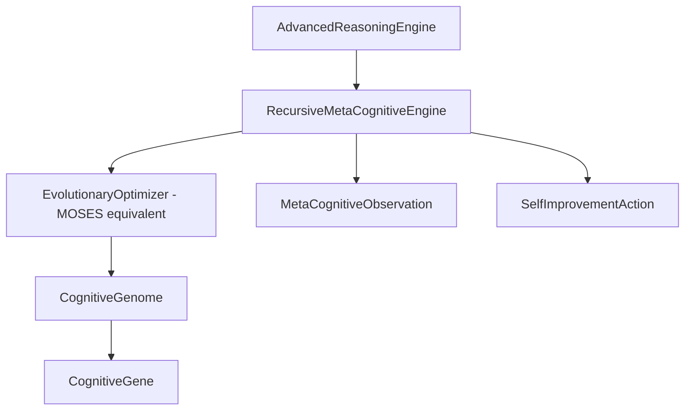
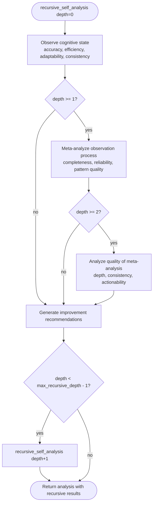
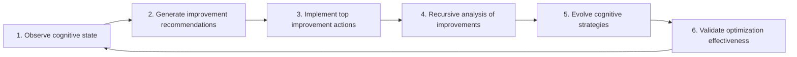
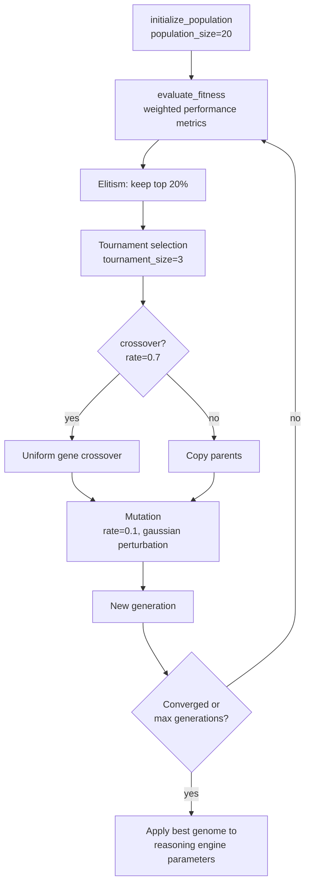

# 🧠 Phase 5: Recursive Meta-Cognitive Pathways

## Overview

Phase 5 enables the system to **observe, analyze, and recursively improve itself**
using evolutionary algorithms. The implementation lives in
`src/integration/recursive_metacognition.py` and is integrated into the
`AdvancedReasoningEngine` (`src/integration/advanced_reasoning.py`) via the
`recursive_meta_engine` attribute.

## Implementation Steps (Complete)

| Step | Requirement | Implementation |
|------|-------------|----------------|
| 1 | Feedback-driven self-analysis modules | `RecursiveMetaCognitiveEngine.observe_cognitive_state()` |
| 2 | MOSES-equivalent kernel evolution | `EvolutionaryOptimizer` (population, fitness, crossover, mutation) |
| 3 | Recursive cognitive observation | `recursive_self_analysis(depth)` with `max_recursive_depth=3` |
| 4 | Self-improvement recommendations | `generate_self_improvement_recommendations()` |
| 5 | Meta-cognitive performance monitoring | `performance_metrics`, `observations` deque, `get_cognitive_status_report()` |
| 6 | Recursive pattern recognition | `detect_recursive_patterns()` (performance, behavioral, meta, evolutionary) |
| 7 | Self-optimization validation | `validate_self_optimization_effectiveness()` |

## Architecture



## Meta-Cognitive Recursion Flowchart



## Recursive Self-Improvement Cycle



Entry point: `RecursiveMetaCognitiveEngine.recursive_self_improvement()` (also
exposed as `AdvancedReasoningEngine.recursive_self_improvement()`).

## Evolutionary Trajectory (MOSES-Equivalent Optimization)

The `EvolutionaryOptimizer` evolves `CognitiveGenome`s — collections of
`CognitiveGene`s controlling reasoning behavior (confidence thresholds,
reasoning depth, strategy diversity, confidence calibration).



Trajectory tracking:
- `EvolutionaryOptimizer.fitness_history` records best/average fitness per generation.
- `RecursiveMetaCognitiveEngine.pattern_evolution_history` records applied genome changes.
- `_detect_evolutionary_patterns()` analyzes convergence, diversity, and improvement rate.

## Cognitive States

The engine tracks its own state via the `CognitiveState` enum:
`EXPLORING → EXPLOITING → LEARNING → OPTIMIZING → REFLECTING → EVOLVING`.

## Testing & Verification

Run the Phase 5 test suite (27 tests):

```bash
pip install numpy pytest psutil
python -m pytest tests/test_phase5_recursive_metacognition.py -v
```

Run the end-to-end demonstration:

```bash
PYTHONPATH=. python demos/demo_phase5_recursive_metacognition.py
```

Coverage includes:
- Self-analysis accuracy and completeness testing
- Evolutionary algorithm effectiveness validation
- Recursive improvement cycle verification
- Meta-cognitive pattern recognition accuracy
- Performance improvement measurement
- Stability testing during self-modification

## Success Criteria

- ✅ Demonstrable self-improvement over time (`validate_self_optimization_effectiveness`)
- ✅ Stable recursive meta-cognitive loops (bounded by `max_recursive_depth=3`)
- ✅ Evolutionary optimization convergence (fitness history tracking)
- ✅ Measurable performance enhancement (baseline vs. post-action metrics)
- ✅ Self-awareness and introspection capabilities (`_perform_self_assessment`)
